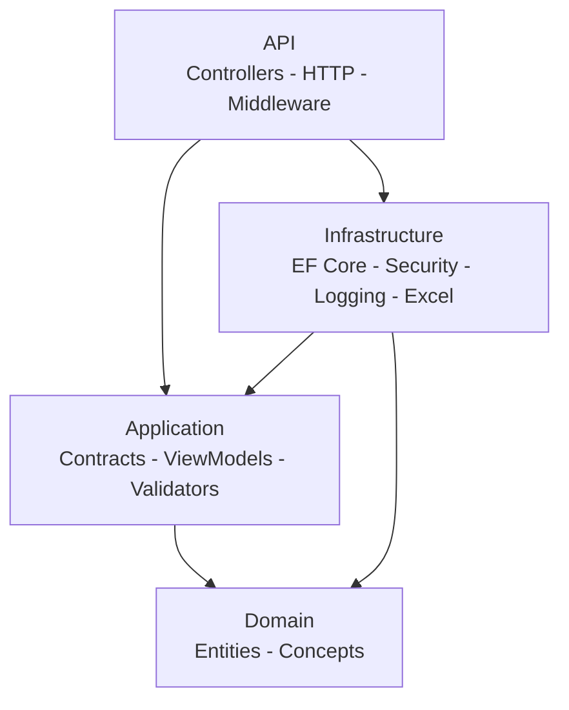
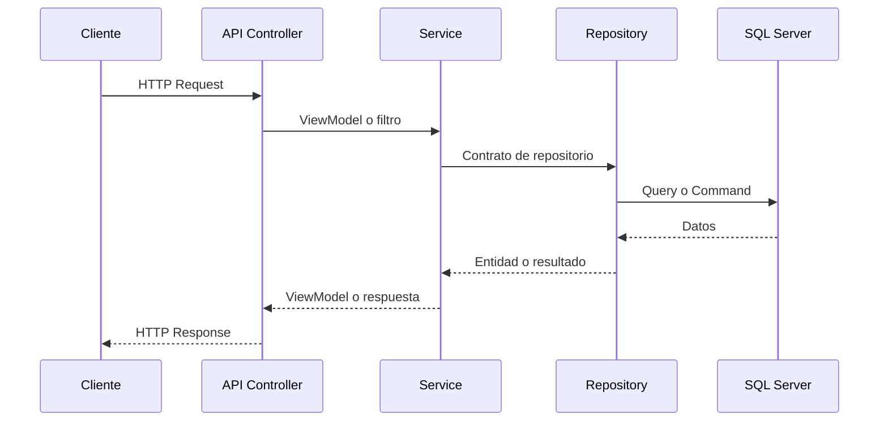

# Gestion.Ganadera.Business.API

API base en `.NET 9` pensada para arrancar proyectos backend con una estructura clara, segura y lista para crecer sin mezclar responsabilidades desde el dia uno.

> Este template no intenta inventar tu negocio.
> Su objetivo es dejar resuelta la base tecnica para que el equipo construya features reales mas rapido y con menos deuda.

## Antes de leer este documento

Si llegas por primera vez al repositorio, esta no deberia ser tu primera parada.

Ruta recomendada:

1. Lee primero el [README raiz](../../README.md)
2. Luego sigue con la [capacitacion guiada](./capacitacion/README.md)
3. Usa este documento cuando ya quieras entender la API con mas detalle tecnico

## Que aporta esta API base

Desde el inicio deja resuelto lo que normalmente consume tiempo en casi cualquier backend:

- arquitectura basada en Clean Architecture
- validacion JWT para integracion con un proveedor externo
- autorizacion por permisos basada en claims del token
- errores consistentes con ProblemDetails
- validacion centralizada con FluentValidation
- observabilidad con logs, metricas, correlation id y health checks
- CRUD reusable para features simples
- auditoria y datos operativos listos para centralizar
- patron reusable para importacion y exportacion Excel

## Stack principal

- `.NET 9`
- `ASP.NET Core Web API`
- `Entity Framework Core`
- `SQL Server`
- `FluentValidation`
- `AutoMapper`
- `Serilog`
- `JWT Bearer`
- `Asp.Versioning`
- `ClosedXML`
- `Swashbuckle`

## Estructura de la solucion

```text
Gestion.Ganadera.Business.API
Gestion.Ganadera.Business.Application
Gestion.Ganadera.Business.Domain
Gestion.Ganadera.Business.Infrastructure
```

## Arquitectura general



### Direccion de dependencias

```text
Domain
   ^
Application
   ^
Infrastructure
   ^
API
```

Reglas clave:

- `Domain` no depende de ninguna capa
- `Application` depende de `Domain`
- `Infrastructure` implementa contratos de `Application`
- `API` compone el sistema y expone HTTP

## Rol de cada proyecto

### `Gestion.Ganadera.Business.API`

Responsabilidades:

- host y configuracion del runtime
- controllers
- validacion JWT y autorizacion
- versionado
- Swagger
- pipeline HTTP
- registro final de dependencias

Los controllers deben ser delgados. Su trabajo es traducir HTTP, no resolver logica del negocio.

### `Gestion.Ganadera.Business.Application`

Responsabilidades:

- contratos de servicios
- contratos de repositorios
- view models
- filtros
- validadores
- contratos transversales opcionales como Excel

Esta capa no debe depender de ASP.NET ni de detalles tecnicos.

### `Gestion.Ganadera.Business.Domain`

Responsabilidades:

- entidades del sistema
- conceptos estables del dominio
- piezas que no deben quedar atadas a HTTP ni a EF

En este template, `Auditoria` ya vive en `Domain` porque representa un concepto funcional del sistema: el historial de cambios de entidades de negocio.

### `Gestion.Ganadera.Business.Infrastructure`

Responsabilidades:

- `DbContext`
- repositorios EF Core
- servicios tecnicos
- seguridad tecnica
- observabilidad
- integracion con Excel

Aqui viven los modelos tecnicos, por ejemplo:

- eventos de seguridad
- metricas de solicitud
- logs operativos
- persistencia y mapeos EF

### Sin proyecto `Shared`

Este template no mantiene un proyecto `Shared`.

Las piezas transversales viven en la capa que realmente las usa:

- permisos y atributos HTTP en `API`
- regex y ayudas de filtrado en `Application`
- utilidades de tipos para consultas dinamicas en `Infrastructure`

## Composition Root

La composicion principal del sistema se hace en:

- [Program.cs](../../Gestion.Ganadera.Business.API/Program.cs)
- [DependencyInjectionExtensions.cs](../../Gestion.Ganadera.Business.API/Extensions/DependencyInjectionExtensions.cs)
- [ApiServiceExtensions.cs](../../Gestion.Ganadera.Business.API/Extensions/ApiServiceExtensions.cs)

Aqui se registran:

- options
- servicios base de la API
- repositorios
- servicios
- validadores
- seguridad
- middlewares

## Flujo de un request



## Pipeline HTTP

El `Program.cs` deja armado un pipeline pensado para:

1. correlation id
2. manejo global de errores
3. middlewares base
4. autenticacion y autorizacion
5. rate limiting
6. metricas por request
7. endpoints

Este orden no es casual. Afecta trazabilidad, consistencia y seguridad.

## Seguridad

La API usa autenticacion basada en `JWT Bearer`, pero no emite tokens ni mantiene usuarios internos.

### Flujo simplificado

```text
Cliente
   -> obtiene JWT desde AuthService externo
   -> envia Bearer token al API
   -> API valida issuer, audience, firma y expiracion
   -> API autoriza por claims de permisos
   -> consumo de endpoints protegidos
```

Configuracion:

```json
"Jwt": {
  "Enabled": true,
  "Issuer": "https://tu-auth-service",
  "Audience": "gestion-ganadera-api",
  "SigningKey": "CLAVE_COMPARTIDA_O_DE_VALIDACION"
}
```

## Swagger

Disponible en desarrollo:

- `/swagger`
- `/swagger/v1/swagger.json`

Por compatibilidad, el template tambien redirige:

- `/openapi/v1.json` -> `/swagger/v1/swagger.json`

## Endpoints operativos

Estos endpoints existen para operacion, monitoreo o descubrimiento tecnico y no necesariamente aparecen en Swagger como endpoints funcionales del dominio.

- `GET /health`
  Ejecuta los health checks registrados por la API. Hoy valida al menos la conexion SQL configurada.
- `GET /swagger`
  Muestra la UI de Swagger en `Development`.
- `GET /swagger/v1/swagger.json`
  Devuelve la especificacion OpenAPI en `Development`.
- `GET /openapi/v1.json`
  Redirige a `/swagger/v1/swagger.json` en `Development`.

Ejemplo rapido:

```powershell
Invoke-RestMethod -Method Get -Uri "https://localhost:7181/health"
```

Respuesta esperada:

```json
{
  "status": "Healthy",
  "checks": [
    {
      "name": "sqlserver",
      "status": "Healthy",
      "description": null
    }
  ],
  "duration": "00:00:00.1234567"
}
```

### Probar JWT desde Swagger

Cuando `Jwt:Enabled` esta en `true`, Swagger expone el boton `Authorize` para enviar el token Bearer en requests protegidos.

Flujo recomendado:

1. Obtiene un token valido desde tu proveedor externo
2. Pulsa `Authorize`
3. Pega el encabezado completo:

```text
Bearer TU_TOKEN
```

4. Llama un endpoint protegido como `GET /api/v1/seguridad/auditoria/1`

Esto permite validar autenticacion y autorizacion desde la misma UI sin depender de endpoints internos de login.

Si `Jwt:Enabled` esta en `false`, la API no exigira token y podras recorrer el template sin integrar todavia el proveedor externo.
En ese modo, Swagger tampoco publicara el esquema `Bearer` como requerimiento global.
Al cambiarlo a `true`, los endpoints protegidos exigiran autenticacion y permisos por claims del JWT.

## Permisos

El template mantiene permisos por controller y por accion usando:

- `ControllerPermission`
- `ControllerPermissionsAttribute`
- `RequirePermissionAttribute`

La decision de autorizacion se toma a partir de claims del JWT. No hay consulta a base de datos para resolver permisos.

Claims soportados:

- `permission`
- `permissions`

### Actor actual para auditoria

La API tambien puede resolver el actor actual desde claims del request autenticado.

Claims priorizados para actor textual:

- `nameidentifier`
- `sub`
- `preferred_username`
- `email`
- `client_id`

Si existe alguno de esos claims, auditoria registra ese valor en `Auditoria_Modificado_Por`.

Para campos numericos heredados por entidades auditables, el template solo asigna actor cuando encuentra un claim convertible a `long`.

Si no hay autenticacion o no existe un claim compatible, la auditoria no inventa un usuario.

## Observabilidad y datos operativos

Este template no solo registra logs. Tambien esta preparado para centralizar informacion operativa entre varias APIs.

Incluye:

- logging estructurado con `Serilog`
- correlation id por request
- metricas por request
- health checks
- eventos de seguridad
- auditoria de cambios

Las metricas se capturan desde middleware HTTP, pero su persistencia se delega a contratos de observabilidad para evitar acoplar la capa web a `DbContext`.

La tabla `Seguridad.Log_Aplicacion` pertenece al pipeline de logging con `Serilog`.
Por eso puede existir en la base sin formar parte de las migraciones de EF Core.

### Identificacion del API

Se agrego `ApiInfo.Codigo` para identificar que API origino un registro operativo.

```json
"ApiInfo": {
  "Codigo": "gestion-ganadera-api"
}
```

Ese valor ya se propaga a:

- auditoria
- metricas
- eventos de seguridad
- logs de aplicacion

## Validacion y errores

La API usa `FluentValidation` y devuelve errores con `ProblemDetails`.

Ventajas:

- formato consistente
- respuestas previsibles
- mejor trazabilidad
- integracion mas limpia con frontend y clientes externos

## Rate limiting

La limitacion de solicitudes es configurable desde `appsettings.json`.

Si `RateLimiting:Global:Enabled` esta en `true`, la API registra y aplica la politica global.
Si esta en `false`, el template no registra ni aplica rate limiting.

Configuracion base:

```json
"RateLimiting": {
  "Global": {
    "Enabled": true,
    "PermitLimit": 100,
    "WindowSeconds": 60,
    "QueueLimit": 0
  }
}
```

Esto evita tener que implementar logica manual de proteccion endpoint por endpoint.

## Como validar el template sin una feature demo

El template ya no incluye una entidad de ejemplo dentro del dominio base.

La validacion recomendada queda asi:

- usa `Auditoria` para probar autenticacion, autorizacion y filtrado generico
- usa `smoke-api.ps1` para validar arranque y health check
- crea tu primera feature real siguiendo [capacitacion/07-como-crear-una-feature.md](./capacitacion/07-como-crear-una-feature.md)
- aplica Excel solo si esa feature lo necesita

## Migraciones y base de datos

En `Development`, la API aplica migraciones automaticamente al iniciar:

- ejecuta `Database.MigrateAsync()`

Fuera de `Development`, la aplicacion no migra datos automaticamente.
En esos ambientes, las migraciones deben aplicarse de forma controlada por el equipo o por el pipeline de despliegue.

Si agregas nuevas columnas o entidades:

1. actualiza modelos y configuraciones EF
2. crea la migracion
3. aplica `database update`

## Patron base CRUD

Para features simples el template incluye:

- `BaseController`
- `BaseService`
- `BaseRepository`

Esto acelera el desarrollo sin obligarte a reescribir el mismo CRUD una y otra vez.

Por defecto, ese CRUD base responde con codigos HTTP consistentes con operaciones REST comunes:

- `POST`: `201 Created`
- `PUT`, `PATCH` y `DELETE`: `204 No Content`
- errores de operacion: `ProblemDetails`

En `PATCH`, el codigo del recurso debe enviarse solo en la ruta.
Si el cuerpo incluye la propiedad de codigo, el template rechaza la solicitud con error de validacion.

> Usalo para escenarios simples.
> Si una feature crece en reglas o comportamiento, dale contratos y servicios propios.

## Patron base para Excel

El template incorpora un patron reusable para Excel.

### Que resuelve

- exportacion con filtros
- importacion con validacion por fila
- limite maximo de filas configurable
- descarga de plantilla de importacion
- separacion entre modelo de exportacion y modelo de importacion

### Contratos base

En `Application` la familia extendida de `IBaseService` ya soporta Excel:

- `IBaseService<TViewModel, TCreateViewModel, TUpdateViewModel, TExportFilter>`
- `IBaseService<TViewModel, TCreateViewModel, TUpdateViewModel, TExportFilter, TImportModel>`

### Base reusable

En `Infrastructure` y `API` existen variantes reutilizables:

- [BaseService.cs](../../Gestion.Ganadera.Business.Infrastructure/Services/Base/BaseService.cs)
- [BaseController.cs](../../Gestion.Ganadera.Business.API/Controllers/Base/BaseController.cs)

Esta base ya resuelve:

- generacion del archivo Excel
- lectura del archivo si la feature habilita importacion
- validacion del filtro de exportacion
- limite de importacion
- generacion de plantilla de importacion opcional

### Configuracion del limite

```json
"ExcelImport": {
  "MaxRowsPerImport": 500
}
```

### Cuando aplicarlo

Este patron esta pensado para entidades funcionales del negocio o catalogos administrables.

Ejemplos donde si suele tener sentido:

- maestros o catalogos
- parametrizacion de negocio
- cargas masivas controladas
- exportacion operativa para usuarios

Ejemplos donde normalmente no conviene aplicarlo:

- auditoria
- logs
- metricas
- eventos de seguridad

Las tablas operativas como `Auditoria` deben priorizar trazabilidad y consulta, no importacion o plantillas de carga.

## Ejemplo real: Auditoria

`Auditoria` sigue siendo una feature importante del template, pero ahora cumple el rol correcto:

- entidad en `Domain`
- persistencia en `Infrastructure`
- consulta y filtrado desde la API
- trazabilidad de cambios sobre entidades de negocio

Esto ayuda a dejar claro que no toda tabla debe exponerse para importacion o exportacion solo porque el template tenga la capacidad tecnica.

## Como agregar una feature nueva

### CRUD simple

1. crear la entidad en `Domain` si representa un concepto real del sistema
2. crear `ViewModel`, `CreateViewModel` y `UpdateViewModel` en `Application`
3. crear validadores
4. crear interfaz de repositorio
5. implementar repositorio en `Infrastructure`
6. implementar servicio
7. crear controller

### Como heredar las bases

Si la feature es CRUD simple, el camino recomendado es:

1. heredar de `BaseRepository<TEntity>` en `Infrastructure`
2. heredar de `BaseService<TEntity, TViewModel, TCreateViewModel, TUpdateViewModel, TRepository>` en `Infrastructure`
3. heredar de `BaseController<TViewModel, TCreateViewModel, TUpdateViewModel>` en `API`

Eso te da de base:

- `GET {codigo}`
- `GET`
- `POST`
- `POST bulk`
- `PUT`
- `PATCH {codigo}`
- `DELETE {codigo}`
- `POST filtrar`
- `GET paginado`

Los endpoints por foreign key solo aplican si el `TViewModel` define una propiedad marcada con `[ForeignKeyDefault]`.
Si la feature no tiene una llave foranea clara, esos endpoints base no deben considerarse parte del contrato usable de esa feature.

### Feature con Excel

1. crear el filtro de exportacion
2. crear validador del filtro
3. heredar de `BaseService<TEntity, TViewModel, TCreateViewModel, TUpdateViewModel, TRepository, TExportFilter>`
4. heredar de `BaseController<TViewModel, TCreateViewModel, TUpdateViewModel, TExportFilter>`
5. si la feature necesita importacion o plantilla, usar la variante extendida:
   - `BaseService<TEntity, TViewModel, TCreateViewModel, TUpdateViewModel, TRepository, TExportFilter, TImportModel>`
   - `BaseController<TViewModel, TCreateViewModel, TUpdateViewModel, TExportFilter, TImportModel>`
6. declarar en `ControllerPermissions` solo las capacidades que apliquen:
   - `ExportExcel`
   - `ImportExcel`
   - `DownloadExcelTemplate`

Antes de aplicarlo, valida que la entidad realmente lo necesite. El hecho de que el template lo soporte no significa que deba habilitarse en cualquier modulo.

Para una guia paso a paso mas enfocada en herencia de bases y puntos de extension, revisa [capacitacion/07-como-crear-una-feature.md](./capacitacion/07-como-crear-una-feature.md).

## Que evitar

Evita estas decisiones porque erosionan la arquitectura:

- logica de negocio en controllers
- acceso directo a `DbContext` desde `Application`
- dependencias de ASP.NET en `Application`
- modelos tecnicos en `Domain`
- usar el mismo modelo para importar, exportar y responder HTTP
- exportaciones masivas sin filtros
- importaciones sin validacion y sin limites

## Buenas practicas al extender el template

- usa `Domain` para conceptos reales del sistema
- deja en `Infrastructure` los modelos puramente tecnicos
- manten `Application` libre de detalles web
- documenta con comentarios cortos las clases base
- cuando una feature deje de ser CRUD simple, sacala del patron generico y dale contratos propios

## Que le falta al template

El template ya tiene una base fuerte, pero todavia puede crecer con:

- tests automaticos por capa
- documentacion de permisos por controller o por modulo
- guia de naming y convenciones del repositorio

## Filosofia

La meta no es abstraer por moda ni forzar un dominio complejo cuando todavia no existe.

La meta es:

- empezar rapido
- mantener bajo acoplamiento
- dejar un camino claro para crecer
- evitar deuda estructural temprana

Si el proyecto sigue siendo un template, esta bien que parte del dominio todavia sea pequeno. Lo importante es que las fronteras esten bien marcadas para que cuando aparezca la logica real, el sistema ya tenga donde vivir correctamente.
